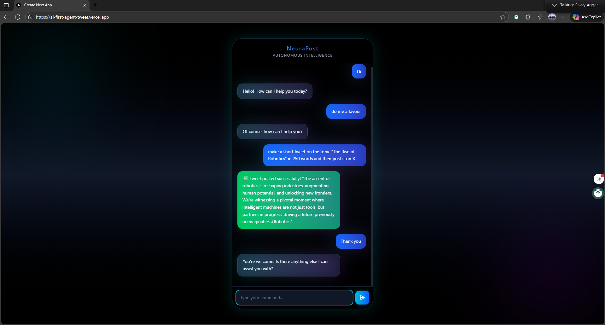

# 🧠 NeuraPost — Autonomous Social Media Agent

An AI-powered, multi-platform content automation system that autonomously creates, curates, and posts content across **X (Twitter)**, **LinkedIn**, and **Instagram**, powered by **Gemini + MCP architecture**.


---

### ▶️ [Live Demo](https://ai-first-agent-tweet.vercel.app/)

---

## 📖 About The Project

**NeuraPost** is an **autonomous AI social media agent** that intelligently generates and posts content across multiple platforms using **Gemini AI** and a modular **MCP tool system**.  
It’s designed for creators, businesses, and developers who want to automate their social media workflows — from idea generation to posting — with human-like intelligence and aesthetic precision.

The architecture combines a **Next.js frontend** with a **Node.js MCP backend** hosted separately for modularity and scalability.  
NeuraPost integrates APIs for **X (Twitter)**, **LinkedIn**, and **Instagram**, using dynamic tool invocation and real-time response handling for flawless automation.



---

## 🌟 Key Features

-   🤖 **Tweeter-Platform Posting**: Post AI-generated content to **X** through platform-specific MCP tools.
-   🧠 **Gemini-Powered Creativity**: Uses **Google Gemini 2.5 Flash** for intelligent, brand-aware text generation.
-   ⚙️ **Tool-Oriented MCP System**: Each platform integration is modularized as a “tool” within the MCP architecture.
-   💬 **Real-Time Chat Interface**: Interactive chat UI for direct AI conversations and live content generation feedback.
-   🛰️ **Render + Vercel Deployment**: Decoupled hosting for better scalability and CORS-safe communication.
-   🎨 **Agentic Futuristic UI**: Modern, dark-themed “AI Console” inspired by X’s sleek aesthetic.
-   🔐 **Secure API Key Management**: Credentials managed through Render environment variables; no client exposure.
-   🧩 **Extensible Tool Registry**: Easily add new platforms or automation endpoints as “tools” — like scheduling, analytics, or content rewriting.

---

## 🔧 Tech Stack

This project leverages a hybrid full-stack architecture optimized for AI-assisted automation and distributed deployment.

| Technology | Role & Justification |
|-------------|----------------------|
| **Next.js** | **Frontend Framework**: Handles real-time chat UI, rendering, and interaction with Gemini and MCP tools. |
| **Node.js + Express** | **Backend Runtime**: Core of the MCP tool layer. Manages posting endpoints, CORS, and structured API communication. |
| **Gemini AI (via @google/generative-ai)** | **Text Generation Engine**: Powers intelligent content generation, tone adjustment, and post summarization. |
| **Socket.IO** | **Real-Time Engine**: Enables live feedback and progress updates from the MCP server. |
| **Tailwind CSS** | **Styling Framework**: Provides rapid design iteration with a modern, glassy, “agentic” aesthetic. |
| **CORS Middleware** | **Security Layer**: Enables safe communication between Vercel (frontend) and Render (backend). |
| **Twitter API v2** | **Platform Tool**: Used to publish tweets programmatically via `tweetOnX` tool. |
| **LinkedIn API v2** | **Platform Tool**: Used for professional content posting via `postOnLinkedIn`. |
| **Instagram Graph API** | **Platform Tool**: Used for image and caption publishing via `postOnInstagram`. |
| **Render & Vercel** | **Hosting Stack**: Render for Node.js MCP backend, Vercel for Next.js frontend with CI/CD pipelines. |

---

## 📦 Getting Started

This repository contains two core services:  
1. **Frontend (Next.js)**  
2. **Backend (MCP Server)**

### Prerequisites

- **Node.js** (`v18` or later)
- A **Render** account (for backend)
- A **Vercel** account (for frontend)
- **API Keys** for X, LinkedIn, and Instagram

---

### Installation & Setup

1. **Clone the repository**
    ```bash
    git clone https://github.com/vikasgautam2003/NeuraPost.git
    cd NeuraPost
    ```

2. **Setup the MCP Backend (`/server`)**
    ```bash
    cd server
    npm install
    ```
    Create a `.env` file:
    ```env
    GOOGLE_API_KEY=your_gemini_api_key
    X_API_KEY=your_twitter_api_key
    X_API_SECRET=your_twitter_api_secret
    X_ACCESS_TOKEN=your_twitter_access_token
    X_ACCESS_SECRET=your_twitter_access_secret
    LINKEDIN_ACCESS_TOKEN=your_linkedin_token
    LINKEDIN_PROFILE_ID=your_linkedin_profile_id
    INSTAGRAM_ACCESS_TOKEN=your_instagram_token
    INSTAGRAM_BUSINESS_ID=your_instagram_business_id
    PORT=5000
    ```

3. **Setup the Next.js Frontend (`/client`)**
    ```bash
    cd ../client
    npm install
    ```
    Create a `.env.local` file:
    ```env
    NEXT_PUBLIC_MCP_URL=http://localhost:5000
    GOOGLE_API_KEY=your_gemini_api_key
    ```

---

### ▶️ Running Locally

1. **Start the MCP Backend**
    ```bash
    cd server
    npm run dev
    ```

2. **Start the Frontend**
    ```bash
    cd client
    npm run dev
    ```

The application will be available at:  
👉 **http://localhost:3000**

---

## 📁 Project Structure

